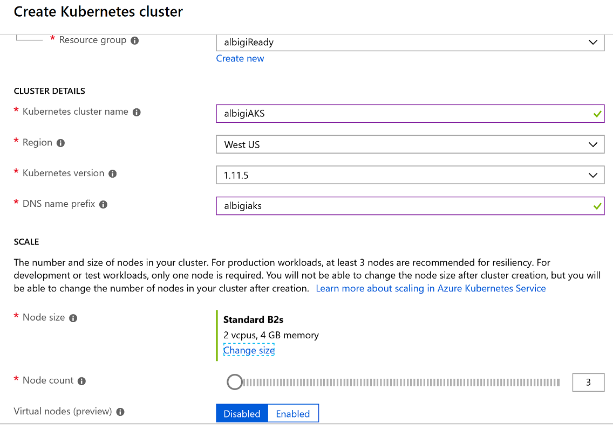
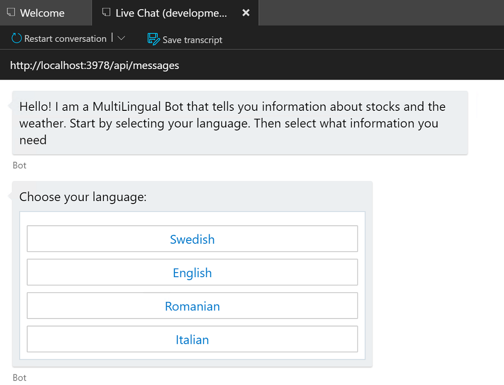
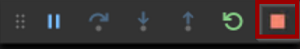
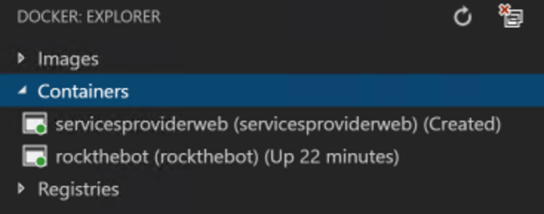
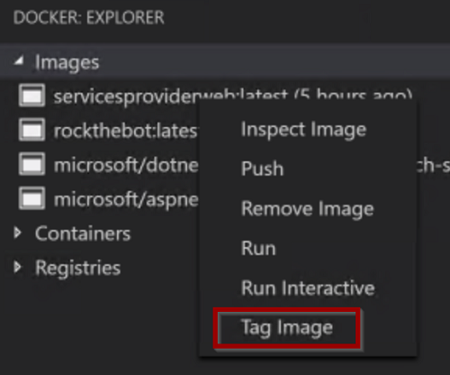
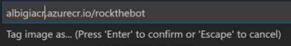
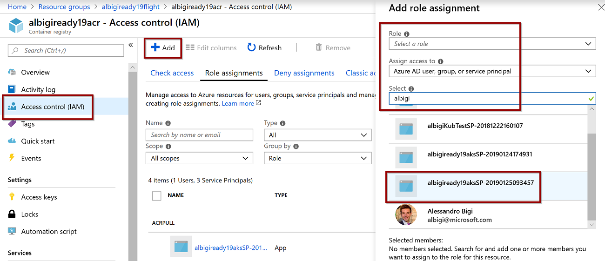
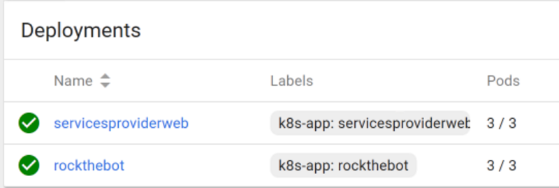

<h1><p align="center"> Microsoft Ready 2019 <br/><br/> AI-APP-ST315 <br/><br/><br/><br/> Rock the Bot: build a highly scalable Bot using Bot Framework, ASP.NET Core and Kubernetes
</h1>
<h2>
<p align="center">Alessandro Bigi (<b>albigi</b>)</p>
<p align="center">Roxana Gheorghe (<b>rogheorg</b>)</p>
</h2>

----------------- 

## CONTENTS ##
  - [CONTENTS](#contents)
  - [INTRODUCTION](#introduction)
    - [Estimated time](#estimated-time)
    - [Objectives](#objectives)
    - [Prerequisites](#prerequisites)
    - [Lab Overview](#lab-overview)
    - [Solution Architecture](#solution-architecture)
    - [Computers in this lab](#computers-in-this-lab)
  - [GETTING THINGS READY](#getting-things-ready)
  - [EXERCISE 1 - AZURE SETUP](#exercise-1---azure-setup)
    - [Task 1 - Create a new ACR](#task-1---create-a-new-acr)
    - [Task 2 - Create a new AKS](#task-2---create-a-new-aks)
  - [EXERCISE 2 - BUILD THE BOT](#exercise-2---build-the-bot)
    - [Task 1 - Clone the source repo](#task-1---clone-the-source-repo)
    - [Task 2 - Complete the code](#task-2---complete-the-code)
      - [1. Translation middleware](#1-translation-middleware)
      - [2. Create the language selection card](#2-create-the-language-selection-card)
      - [3. Keeping track of the user state](#3-keeping-track-of-the-user-state)
    - [Task 3 - Build and Run the Bot](#task-3---build-and-run-the-bot)
    - [Task 4 - Test the Bot](#task-4---test-the-bot)
  - [EXERCISE 3 - CREATE AND DEPLOY THE CONTAINERS](#exercise-3---create-and-deploy-the-containers)
    - [Task 1 - Create and run the containers](#task-1---create-and-run-the-containers)
    - [[OPTIONAL] Task 2 - Test the Bot in the container](#optional-task-2---test-the-bot-in-the-container)
    - [Task 3 - Deploy the containers to ACR](#task-3---deploy-the-containers-to-acr)
  - [EXERCISE 4 - CONFIGURE AKS](#exercise-4---configure-aks)
    - [Task 1 - Create a new service in AKS](#task-1---create-a-new-service-in-aks)
    - [Task 2 - Configure the reverse proxy](#task-2---configure-the-reverse-proxy)
    - [Task 3 - Test the Bot](#task-3---test-the-bot)
  - [[OPTIONAL] EXERCISE 5 - PUBLISH THE BOT](#optional-exercise-5---publish-the-bot)
    - [Task 1 - Create the Bot Service](#task-1---create-the-bot-service)
    - [Task 2 - Configure the AKS secrets](#task-2---configure-the-aks-secrets)
    - [Task 3 - Create the channels](#task-3---create-the-channels)
  - [EPILOGUE](#epilogue)

## INTRODUCTION ##
### Estimated time ###
The lab was designed and tested in order to take at most **120 minutes** for attendees aiming at 100% completion (optional tasks excluded).
However, some of the tasks may vary in duration based on unpredictable external factors (mainly networking and Azure deployment operations).

Not to worry though! In the unlikely event you won't be able to complete all the lab exercises, we'll share all the details on where to find the lab documentation and exercises at any future point!

### Objectives ###
After completing this lab, you will be better at:
   - Building an intelligent Bot using the Microsoft Bot Framework v4 SDK
   - Using Microsoft Translator API to add real-time translation skills to your Bot
   - Understanding the basic architecture of conversations in the Microsoft Bot Framework
   - Using the Bot Framework Emulator to test your Bot
   - Understanding the basic architecture of a ASP[]().NET Core Web Api app
   - Creating a container image using Docker client
   - Deploying a container image to Azure Container Registry
   - Creating an Azure Kubernetes Service to host and manage containerized micro-services apps
   - Create an Azure Bot Service and publish your bot to several channels

### Prerequisites ###
This document is designed to walk you through the whole lab and provide you with the necessary information to cover the main session takeaways. However, to take the most out of the lab you are recommended to have:
   - Good knowledge of the Azure Portal
   - Introductory knowledge of ASP[]().NET Core
   - Introductory knowledge of Docker and containers
   - Basic understanding of the Azure Bot Service architecture
   - Basic understanding of micro-services architecture design
   - Introductory knowledge of Kubernetes or other orchestration services

### Lab Overview ###
The lab consists of 4 exercises, to be completed in sequential order.
1. You will create all the necessary resources on Azure. Namely an Azure Container Registry (ACR) and an Azure Kubernetes Service (AKS).
   
   Expected time to complete: **15 minutes**
2. You will build a v4 chat Bot that depends on a services API app. Then, you will add translation services to it. Eventually, you will test the Bot locally using the Bot Framework Emulator.

   Expected time to complete: **30 minutes**

3. You will create two containers to host the core Bot application and the services API it consumes. Then, you will upload the containers to the ACR and eventually create a Kubernetes workload in AKS to deploy and host the containers in two Kubernetes services.

   Expected time to complete: **30 minutes**

4. You will create an Azure Bot Service to publish your Bot hosted on AKS using the DirectLine and Skype channels.
   
   Expected time to complete: **30 minutes**

### Solution Architecture ###
Upon completing this lab you will have implemented a solution similar to the following:


### Computers in this lab ###
You need to use just one Virtual Machine, running Windows 10 and *Docker for Windows*. The VM settings are reported in the table below. Before you begin the lab, please make sure the VM is started and you are logged on using the credentials provided below:

| Username | Password |
| --- | --- |
| Ready19 | ReadyPassword! |


## GETTING THINGS READY ##
To get started you will need:
   -  one **Container Registry** (ACR)
   -  one **Azure Kubernetes Service** (AKS)
   -  Azure subscription owner or contributor access to the AKS and ACR resources (to grant access permissions to ACR and AKS resources) 
   -  Docker client with the **Docker CLI** installed
   -  The **Azure CLI** installed
   -  The **.NET Core 2.2 SDK** installed

Once identified the Azure Subscription to use, please open a browser on the VM and **login to the Azure Portal** ([http://portal.azure.com](#)).

## EXERCISE 1 - AZURE SETUP ##

### Task 1 - Create a new ACR ###
Once logged in to the Azure portal, create a new resource of type **Container Registry**:

   

Confirm selecting **Create** on the outer blade.

Fill in the required information in the new blade:
- **Registry Name**: a unique name for your ACR. You can pick one of your choice but an easy name is recommend (hint: **`youralias`**`ACR`)
- **Resource Group**: you can create a new one or pick an existing of your choice
- **Location**: select *West US* for lower latency
- **Admin User**: *Disabled*
- **SKU**: *Standard*

The form should resemble the following:

   

Hit **Create** to start the deployment.

It may take a few minutes for the new ACR to be fully deployed. Once done, you will be notified in the Azure Portal.

**Let the deployment run and move on to the next task.**

### Task 2 - Create a new AKS ###
In the Azure Portal, create a new resource of type **Kubernetes Service**:

   

Confirm selecting **Create** on the outer blade.

The setup of AKS requires a few steps:

1. Fill in the first tab (*Basic*) as follows:
     - **Resource Group**: select the same resource group used before
     - **Kubernetes cluster name**: select a friendly name for your AKS cluster (hint: **`youralias`**`AKS`)
     - **Region**: select `West US` for lower latency
     - **Kubernetes version**: leave the *default* (latest)
     - **DNS name prefix**: this is the DNS name prefix of your cluster, used when connecting to it for administration. Select one of your choice (hint: reuse the cluster name in lower letters)
     - **Node size**: click on **Change size** and select the `Standarb B2s` size *(2vcpus, 4GB memory)*. Your workload will be light enough to accomodate small node instances.
     - **Node count**: leave the *default* (`3` nodes)
     - **Virtual nodes**: `Disabled`

   The form should look like this:
   

   Click **Next: Authentication >** and proceed to the next tab.

2. Make sure the **Authentication** section uses the defaults, shown below
   
   

   Click **Next: Networking >** and proceed to the next tab.

3. In the **Networking** section you need to `enable` **HTTP Application Routing**:
   
   

   Click **Next: Monitoring >** and proceed to the next tab.

4. The **Monitoring** section needs to have the **Enable container monitoring** flag switched to `No`

   


You may now click on **Review + create** to review the AKS settings and hit **Create** to start the deployment.

> The ***Create*** button might be disabled for a few seconds while the AKS setup is being validated. Please be patient.

You can regularly check on the AKS deployment by leaving the Azure page open:


<p style="border: 2px solid red; padding: 5px">The deployment of the Kubernetes Service might take a while (<strong>between 5 to 10 minutes</strong>). While Azure deploys the cluster, please advance in the lab and move on to the <strong>Exercise 2</strong>.</p>

## EXERCISE 2 - BUILD THE BOT ##
<p style="border: 2px solid gray; padding: 5px">In this exercise you will clone a GitHub repo to get the base code of your Bot. You will have to complete the code to build the bot. Eventually, you will test the bot running on the dev VM.<br/><br/>
You can find the code snippets used in this exercise in the <strong>CodeFile.cs</strong> file.</p>

### Task 1 - Clone the source repo ###
The base code to start building the bot is located at [https://github.com/albigi/Ready19-RockTheBot](#).
You can either connect to GitHub and download the code as a zip file, or clone the repository on your machine.

To clone the repo, open the **Code** folder on the Desktop (any other folder of your choice would do!). While holding **SHIFT**, right click on the folder and select **Git Bash here**. The Git command prompt should appear.
>For this task you can also use a normal command prompt or powershell.

Once the shell is open, type:

~~~
git clone https://github.com/albigi/Ready19-RockTheBot.git
~~~

In Explorer you should now see a folder named **Ready19-RockTheBot**. This is the main solution folder!
You will notice it contains two subfolders:
1. **RockTheBot** is the actual bot folder!
2. **ServicesProviderWeb** is a *service* ASP[]().NET Core Web API the bot relies on to access some of the data it needs. Its role will become clearer later in the exercises.

Before moving forward, you should initialize the **Azure CLI**. In the main solution folder right click on the **initialize.ps1** script and select **Run with Powershell**. 

>Alternatively you can also open a Powershell or command prompt and type:<br/>
`az account clear`<br/>
`az login`<br/>

The script will log you in to Azure: use the same credentials you used in the previous exercise. 

>In case you are using your own account to login to Azure and you have access to multiple subscriptions, the previous script will give you access to the *default subscription*. To switch subscriptions, you can use `az account set --subscription "SUB NAME OR ID"`

### Task 2 - Complete the code ###
You will now start working on the actual bot code. This version of the code was slightly customized out of the default Azure Bot Service template. But don't worry, you will be adding all the juicy details and customizations!
>If you try to compile the code as is, it won't work. This is expected and you will have to complete it reading on.
<br/>
**NOTE**: you can skip this task by replacing the files *RockTheBot.cs* and *Startup.cs* with their pre-completed versions: **RockTheBot.cs.complete** and **Startup.cs.complete**. All you have to do is delete the original *.cs* files and remove the *.complete* file extension from the other two.

First, open the **RockTheBot** folder in Visual Studio Code: right click on the folder in Explorer and select **Open with Code**.

>At some point Visual Studio Code should prompt you to restore *unresolved dependencies* for the project: accept and click **Restore**.

#### 1. Translation middleware ####
The new Bot Framework v4 had the ASP[]().NET Core integration as one of its main goals. Actually, a v4 bot is nothing else than a ASP[]().NET Core Web API with specialized middleware.<br/>
Indeed, middleware is one of the bonus aspects of the v4 SDK: expanding and customizing the bot functionality is now much easier.

>A middleware is a piece of code that is assembled into an app pipeline to handle requests and responses. Middlewares are executed one by one, in the order in which they are declared in the **Startup.ConfigureServices()** method.

The bot relies on the *Translation Middleware* to translate user text. It reads the user's preferred language from the user's state and, if it is different from the default language (English), calls the *Microsoft Translator Text API* to translate from and to the user's preferred language.
<br/>
This means the bot always receives utterances in English, while users can transparently interact using their preferred language.
Users can change their language preference anytime, and since this gets written to the user state, the middleware will read this state and instantly modify its behavior to honor the newly selected preferred language.

The first step is to declare the translation middleware in the **ConfigureServices** method in the **Startup.cs** file.
Locate **line 140** which should look like this:
	
```C#
var translator = new MicrosoftTranslator(translatorKey);
```

After defining the **translator** object and connecting it to the Translator API via the **tranlator key** we need to add the translation middleware to the API pipeline.
You need to complete the code by adding the lines below:
```C#
var translationMiddleware = new TranslationMiddleware(
   translator,
   userState.CreateProperty<string>("LanguagePreference"));

options.Middleware.Add(translationMiddleware);
```

>Remember you can find the missing code in the **CodeFile.cs** file.

Notice the translation middleware is added simply by passing its instance to the `options.Middleware` object of the Bot SDK.

#### 2. Create the language selection card ####

Now the translation middleware is plugged-in, it is time to construct the card that lets the user select their language. 

>If the bot's response to the user needs to contain something other than text, you can use a card to display any combination of text, speech, images, buttons, and input fields. There are different types of cards, depending on what type of interaction you are designing for your bot.

You will use a HeroCard as a simple way to present buttons to the user. The HeroCard allows to create a list of suggested actions to shown to the user for every conversation turn.

In the **RockTheBot.cs** file, locate the **SendLanguageCardAsync** method (**line 179**):

```C#	
private static async Task SendLanguageCardAsync(ITurnContext turnContext, CancellationToken cancellationToken)
{
   var reply = turnContext.Activity.CreateReply("Choose your language:");
   reply.Attachments = new List<Attachment>();
   List<CardAction> cardButtons = new List<CardAction>();
   
   # TODO :  add the different actions for each language. 
   //do something awesome here

   HeroCard heroCard = new HeroCard()
   {
      Buttons = cardButtons,
   };
   Attachment attachment = heroCard.ToAttachment();
   reply.Attachments.Add(attachment);
   await turnContext.SendActivityAsync(reply);
}
```
You should now complete the method and define what the **HeroCard** card should look like.<br/>
You need to define the card buttons for each language your bot needs to support. The card buttons should look like this:

```c#
cardButtons.Add(new MultilingualCardAction(language) { CardTitle = "English", Type = ActionTypes.PostBack, Value = EnglishEnglish });
```
Note you can customize the card's title as well as the postback value it sends to the bot. This value is used by the tranlator middleware to understand what translation is requested. The value format is of type ***InputLanguage*OutputLanguage**.<br/>
Add as many cards ad the languages your bot should support.

>Hint: you can peek at the implementation of a *HeroCard* for another user prompt in the method **SendSuggestedActionsAsync**<br/><br/>
The full code block is also available in the **CodeFile.cs** file.

#### 3. Keeping track of the user state ####
	
If the bot is to send a welcome message every time a new user conversation starts, which is usually a desired feature, it needs to determine whether the message has already been sent. In addition, the bot needs to keep track of the users preferred language. Both of the above are typical situations where the bot state comes in handy.

>You can store and retrieve state data that is associated with a user, a conversation, or a specific user within the context of a specific conversation. State data can be used for many purposes, such as determining where the prior conversation left off or simply greeting a returning user by name.<br/><br/>
Ideally, the bot state should persist the bot application lifetime. However that would require an out-of-memory state provider (like a cache or a database).<br/>
For testing and prototyping purposes, you can use the Bot Builder Framework's in-memory data storage, but for production bots, it is recommended to implement your own storage adapter or use one of the available Azure Extensions (Table Storage, CosmosDB, or Azure SQL).

In the **OnTurnAsync** method in **RockTheBot.cs** a flag has to be set in case the user has already been welcomed. After setting the `DidBotWelcomeUser` flag you also need to update the state objects to *commit*  the state change so that it will be persisted. <br/>
The code needs to be added within the conditional statement to check whether the Activity we have received is of type Message, at **line 80**

```C#
 if (turnContext.Activity.Type == ActivityTypes.Message)
 {
    # TODO :

    //if our didBotWelcomeUser flag is set to false, set it to true 
    // Update user state flag to reflect bot handled first user interaction.

 }
```

You need to complete the code by adding the lines below:
```C#
didBotWelcomeUser.DidBotWelcomeUser = true;

// Update user state flag to reflect bot handled first user interaction.
await _accessors.WelcomeUserState.SetAsync(turnContext, didBotWelcomeUser);
await _accessors.UserState.SaveChangesAsync(turnContext);
```

>Remember you can find the full code fragment in the **CodeFile.cs** file.

Notice the `_accessors` object provides access to the different user states defined. In this case:
- The `WelcomeUserState` is used to persist information on sending the welcome message
- The `UserState` is the default state which is updated at every conversation turn


### Task 3 - Build and Run the Bot ###
Now that you are done editing the code, you need to make sure both applications actually compile and run.

1. Browse to the **RockTheBot** folder and open it in Visual Studio Code
2. Select ***Debug > Start Debugging*** (or hit F5)
   >VS might prompt you to either download the *required assets* or select the debugging environment to use. Select *yes* in the former case or *.NET Core* in the latter.
3. After a few seconds, you should see your bot is live!
   
   

   It is now time to run the services API too!
   Leave the VS instance running and move back to the main code folder.

4. Repeat the steps `1` and `2` but open the **ServicesProviderWeb** folder this time. You should have two instances of VS Code running at this point.
5. In the new instance of VSCode press F5 and wait for the application to be online.
   >If this is the first time you open this project, VS might warn you also this time:
      
   
6.  The browser will open and show you a 404 page: this is OK as the API does not use any welcome page.
7.  To test the API is working fine, try to browse to [http://localhost:5000/api/weather](#). You should get a similar result:
    
         {"Name":"Seattle","Country":"US","Description":"fog","Temperature":"9.4C (49F)"}

At this stage, both applications are up and running!

### Task 4 - Test the Bot ###
While it is fairly easy to test the API, you cannot test the Bot application just using a browser.

The **Bot Framework Emulator** is a troubleshooting application designed to help you test and debug your Bot.

1. Open the main code folder then browse to *RockTheBot > RockTheBot* and double click the file ***RockTheBot.bot***
2. The Bot Framework Emulator (BFE) will open and automaically connect to the *development* endpoint
3. If the endpoint is correct and the bot is up and running, you should see the Bot's welcome message:
   
   

4. Select your favorite language and ask the Bot for the MSFT Stock value or the current weather
5. You should get a similar output
   
   

<p style="color: red"><strong>That's great! The Bot and API are working!</strong></p>

## EXERCISE 3 - CREATE AND DEPLOY THE CONTAINERS ##
<p style="border: 2px solid gray; padding: 5px">In this exercise you will create two containers using Docker, then upload them to the Container Registry and configure AKS to deploy them.</p>

### Task 1 - Create and run the containers ###
Stop both the Bot and API apps in case they are still running. 
>You can either stop debugging in VS Code or close the VS Code instances.<br/>
 

Now open the main code folder and browse to the directory *RockTheBot*. Right-click the file **build.bat** and select *Open with Code*.
Inspect the build file:

~~~
@ECHO OFF
set dir=rockthebot
cd %dir%
dotnet publish -c Release -o ..\bin\Release\

cd ..\
docker stop %dir%
docker rm %dir%
docker build -t %dir% .
docker run -d -p 80:80 --name %dir% %dir%
~~~

This file essentially accomplishes two tasks:
1. It produces the production build of the Bot:
   > dotnet publish -c Release -o ..\bin\Release\

2. It creates a new container image named `rockthebot` and starts a new container instance with the same name to host it. Notice the container is exposing the ***TCP port 80*** as the production build of the Bot listens on the default HTTP port.
   > docker build -t %dir% .<br/>
   docker run -d `-p 80:80` --name %dir% %dir%

Before running the build file, you can peek at the **DockerFile** in the same directory. This file is used by Docker to build the image.

~~~
FROM microsoft/aspnetcore:2.0

# Copy the app
WORKDIR /app/
COPY ./bin/Release/ .

EXPOSE 80

CMD ["dotnet", "./RockTheBot.dll"]
~~~

The container build processs is fairly simple:
1. It uses a *base image* called `microsoft/aspnetcore:2.0` which is publicly available from *Docker Hub*: [https://hub.docker.com/r/microsoft/aspnetcore/tags](#). <br/>
This is a basic image with the **dotnet runtime 2.0** installed.

   >It is important the base image matches the runtime your app is using, which is defined in the *project file*.<br/>
   To verify what runtime the Bot application is using, you can open the file *RockTheBot\RockTheBot.csproj* and inspect the **TargetFramework** property defined at line 4: `netcoreapp2.0`

2. On top of the base image, it copies the **application binaries** from the local computer into the */app/* folder in the container.<br/>
   This means the Bot runs in the container within a folder named *app*. 

3. It exposes the **TCP port 80** of the container. This means the container application listening on that port is reachable from outside of the container itself.
4. It sets the **command** to execute when the container image is launched. This essentially defines what operation the container performs trhoughout its instances lifecycles.<br/>
   > `CMD ["dotnet", "./RockTheBot.dll"]` runs the dotnet runtime to host the Bot application


It is now time to run the build file:

1. Browse to the *RockTheBot* folder and double click on the **build** file. A command propt appears and upon script execution you should see a similar output:

   ~~~
   RockTheBot -> C:\Users\Ready19\Desktop\Code\Ready19-RockTheBot\RockTheBot\RockTheBot\bin\Release\netcoreapp2.0\RockTheBot.dll
   RockTheBot -> C:\Users\Ready19\Desktop\Code\Ready19-RockTheBot\RockTheBot\bin\Release\
   Error response from daemon: No such container: rockthebot
   Error: No such container: rockthebot
   Sending build context to Docker daemon  48.76MB
   Step 1/5 : FROM microsoft/aspnetcore:2.0
   ---> db030c19e94b
   Step 2/5 : WORKDIR /app/
   ---> Running in da9a5ee8ee4f
   Removing intermediate container da9a5ee8ee4f
   ---> 7a7d783fb01b
   Step 3/5 : COPY ./bin/Release/ .
   ---> 711fe2aac907
   Step 4/5 : EXPOSE 80
   ---> Running in 01825cf9f8db
   Removing intermediate container 01825cf9f8db
   ---> b76d0cbd489c
   Step 5/5 : CMD ["dotnet", "./RockTheBot.dll"]
   ---> Running in fcb6b7086ba6
   Removing intermediate container fcb6b7086ba6
   ---> 55185675042e
   Successfully built 55185675042e
   Successfully tagged rockthebot:latest
   SECURITY WARNING: You are building a Docker image from Windows against a non-Windows Docker host. All files and directories added to build context will have '-rwxr-xr-x' permissions. It is recommended to double check and reset permissions for sensitive files and directories.
   311b279c14b8bdd2e33e861ec69c74cbaebe37e89fa9458c80309d3fe9dbe332
   Press any key to continue . . .
   ~~~

   >The error *No such container* is expected when you run the build process for the first time!

2. Verify the command logged the following lines:
   >RockTheBot -> C:\Users\Ready19\Desktop\Code\Ready19-RockTheBot\RockTheBot\bin\Release\

   This means the Bot was built successfully.

   >Successfully built 55185675042e<br/>Successfully tagged rockthebot:latest

   This means the container image was also built successfully.

3. Verify a docker container named **rockthebot** is running: open VS Code and click on the *docker extension tab* on the left ribbon. Then, in the outer blade, expand the **Containers** collection and you should see the container is marked as green (running):<br/>
   

   > You can list the running containers using **Docker CLI**:
   open a command prompt or Powershell and type `docker ps`.

4. You can now repeat the steps `1` to `3` for the *ServicesProviderWeb* folder. The build process is exactly alike the previous one.
   
   > You will notice the **build** command takes longer to run for *ServicesProviderWeb*. This is expected as the API application runs with the **dotnet runtime 2.2** which needs to be installed in the container.
   
   As a result, both containers should be up and running:<br/>
   

   > You may notice the *ServicesProviderWeb* container is marked as **created**. This means the container is **not** actually **running**. This is expected: Docker cannot bind to port 80 as the Bot container is already using it!
   

### [Optional] Task 2 - Test the Bot in the container ###
Now both the Bot and the API were published in two separate containers, it's important to remark you cannot run both containers at the same time because of the port conflict explained earlier. Therefore, you could only test one containerized app at a time.

> Actually you could run the two containers at the same time by mapping the *ServicesProviderWeb* container port to a different one. This is very similar to the *NAT* concept of the IP networks and can be achieved by running the command:<br/>
`docker run -d -p 5000:80 --name servicesproviderweb5000 servicesproviderweb`<br/>
However, the Bot would still be unable to call the *servicesproviderweb* endpoint as a result of the apps running in separate containers and, thus, isolated from one another.<br/>

><p style="font-size: smaller">There are more articulated ways of solving this problem but they woult be out of scope for this lab.</p>

If you built the Bot application first, *RockTheBot* should be the container running. You can test the Bot using the **Bot Framework Emulator** repeating the same steps done earlier (Exercise 2.4) but using the **production endpoint** this time:


>In case you are unable to connect to the Bot (no welcome message is displayed and if you try to type a message you get the error ***couldn't send. retry***), this could be a bug in the Emulator. To sort it out make sure the Bot Framework Emulator is setup as follows:<br/><br/>
   a. Click on the settings gear, bottom left:<br/>
   <br/>
   b. Make sure the Emulator is set to use **ngrock** for local addresses (bypass must be **disabled**)<br/>
   <br/>
   c. Type `localhost` in the ***localhost override** field. Delete it in case it was already populated. <br/>
   d. Save the settings, close the settings tab and restart the conversation <br/>
   <br/><br/>
The Bot welcome message should now appear.

### Task 3 - Deploy the containers to ACR ###
Once both the Bot and the API apps are containerized, the next step is to publish them to an online registry. *Docker Hub*, from where you downloaded the base images for your containers, is an example of a public registry.

For Azure workloads, the *Azure Container Registry* service can be used to host container images.
ACR is a private registry and requires authenticated access.

In order to publish a container image to any container repository service, the first step is to ***tag*** it accordingly.

>The tag, in the context of a container image, is both a labling and versioning identifier. Typically an image name consists of 3 parts:<br/>
*`registryIdentifier/imageName:version`*<br/><br/>
While the *`version`* tag can be omitted and defaults to ***latest***, the *`registry identifier`* must exist in order for a docker image to be *pushed* to a remote registry. 

Once the image is tagged, it can be *pushed* to the registry using the *Docker CLI*.

1. In the previous tasks you created two images: *rockthebot* and *servicesproviderweb*. If you open VS Code and inspect the *Docker: Explore* panel expanding the *Images* list you will see both images lack a registry identifier.
   
   
   >You can also ispect the output of the command<br/>
   *`docker image ls`*

2. To find the right *registry identifier* to use, browse to the **Azure Portal**: [https://portal.azure.com](#)
   
   Select the *Azure Container Registry* you created in the first exercise: ***yourAliasACR***. In the overview panel, copy the ***Login server*** property:

   

   `youraliasacr.azurecr.io` is the ***registry identifier*** to use.

3. It is now time to tag the container image.
   - Open VS Code and click on the *Docker: Explorer* extension button
   - Expand the *Images* list and right-click on the first image to tag: ***rockthebot*** 
   - Select **Tag image** and type `youraliasacr.azurecr.io/rockthebot` as tag
   - Confirm with OK: a new image with the desired tag is added to the list

   <br/>

   

   > Alternatively, you can tag the image using the *Docker CLI* by running:<br/>
   `docker tag rockthebot youraliasacr.azurecr.io/rockthebot`

4. Once the image is properly tagged, it is ready to be pushed to the remote registry.
   - Open a new Powershell or command prompt and type:<br/>
      `az acr login --name youraliasacr`
   - If you previously authenticated to Azure, you should see ***Login Succeeded***. Alternatively, follow the login prompt until the command returns.
   - At this time, Docker is authenticated to ACR and the images can be pushed to the registry. 
   - In Powershell or the command prompt type:<br/>
   `docker push youraliasacr.azurecr.io/rockthebot`
   - The operation might take a while to complete and you should see the progress in the command output:
      ~~~
      The push refers to repository [albigiready19acr.azurecr.io/rockthebot]
      4ac7f152bb98: Pushed
      79a0035d08aa: Pushed
      c2734b0f7482: Pushing [=======>                                           ]  21.86MB/154MB
      027f3db1c2f7: Pushing [==================================================>]  8.014MB
      f0296b566559: Pushing [==================>                                ]  16.03MB/43.75MB
      3c816b4ead84: Waiting
      ~~~

   
5. Eventually tag the container image ***servicesproviderweb*** with `youraliasacr.azurecr.io/servicesproviderweb` and push it to ACR repeating the previous steps from `3` to `5`.

By this time, both container images should be uploaded to the ACR registry. Browse to the **Azure Portal** and inspect the ACR resource blade. You should see both images listed within the ***Repositories*** section:


## EXERCISE 4 - CONFIGURE AKS ##
<p style="border: 2px solid gray; padding: 5px">In this exercise you will configure AKS to pull the container images from ACR and create the services cluster. Eventually, you will test the Bot running in AKS.</p>

### Task 1 - Create a new service in AKS ###
Kubernetes can be managed via a command line interface, named `kubectl`, which also exposes a web UI for easier management.

1. **kubectl** should be already available on your system. Open a new Powershell and make sure it is available by typing:<br/>
`Get-Command kubectl`

2. Should **kubectl** not be available, you can install it by running<br/>
   `az aks install-cli`

3. The very next step is to authorize your remote cluster for management by the local instance of **kubectl**. In the Powershell window type:<br/>
   `az aks get-credentials --resource-group` *`yourRGname`* ` --name ` *`yourAKSname`*<br/>
   You can lookup both the *AKS* name and the *Resource Group* it belongs to by opening the **Azure Portal** and opening the AKS resource from the *all resources* view<br/>
   
   

   After running the command you should get a confirmation message:
   ~~~
   Merged "youraliasaks" as current context in C:\Users\Ready19\.kube\config
   ~~~

4. Now **kubectl** is ready and connected to your cluster. You are ready to explore the GUI. In Powershell run:<br/>
   `az aks browse --resource-group` *`yourRGname`* ` --name ` *`yourAKSname`*<br/>
   Wait a few seconds for the proxy to be online and the browser to open the Kubernetes UI.

   >`az aks browse` connects you to your cluster and provides a graphical management interface. The connection to the cluster might become stale after a while: **if you notice the UI stops refreshing or responding, make sure to terminate the command and run it again**. 

5. AKS automatically deploys some *services* to the cluster. One of those is the *kubernetes* service which will be listed in the available services.
   
   > Actually AKS deploys many other services in different namespaces. You can think of namespaces as groups of services, isolated from one another. This is more of a logical grouping rather than a physical one, since services from different namespaces can be deployed to the same cluster nodes.<br/>
   For further information on services, pods, nodes and namespaces you can check the Kubernetes docs.

6. Before deploying the containers to the cluster, you need to grant AKS the required permissions to pull container images from your Container Registry.
   
   1. Browse to the **Azure Portal** and select your **ACR** instance: `youraliasACR`
   2. Select **Access control (IAM)** and then click on **Add > New Role Assignment**
   3. A new blade opens; select:
      - **Role**: `ACRPull`
      - **Assign access to**: `Azure AD user, group or service principal`
      - **Select**: you need to pick the *service principal* linked to your AKS instance. The default name would be in the form `youraliasaks`**`SP-`***`DateOfCreation`* 
   4. The AKS service principal is now listed into the *Role Assignment* tab

   


7. Both container images app are now ready to become a new service in the cluster. For these services, we can use the *default namespace*.
   
   In the Kubernetes UI click on the ***Create*** button, top right of the screen.
   
   You can either enter a *YAML* file or create a new service manually. Create a new service at this time: select **Create an app**. Fill in the form as follows:
   1. **App name**: `rockthebot`
   2. **Container image**: full image tag of the container, e.g: `youraliasacr.azurecr.io/rockthebot`
   3. **Number of pods**: select 3
   
      > Pods are the smallest unit of work in a Kubernetes cluster. They represent the single application instances running and can be in most cases associated to the number of containers being deployed.

   4. **Service**: set it to `Internal` as the Bot should not be directly published on the Internet.
   5. **Port mapping**: Both *Port* and *Target port* must be `80` (default HTTP port) as exposed by the container.

   6. Confirm by hitting **Create** at the bottom of the screen.

   > Be aware that Pods are distinct instances of the container. You should plan for a shared way to manage state if your services are stateful. 

8. To deploy the services API, you can repeat the previous steps and **make sure to call the new service `servicesproviderweb` and pull the image `albigiready19acr.azurecr.io/servicesproviderweb`**.<br/>
   This is important as this name is used by the internal AKS DNS service to map a service name to its Pods.

   The **servicesproviderweb** service to be deployed should resemble the following configuration:

   


9.  You have now created two *services* named **rockthebot** and **servicesproviderweb** in your AKS. Two *deployments* with the same name are also available and you can check on their status by inspecting the Kubernetes UI dashboard or simply by running `kubectl get deployment`.
   
      

   >In Kubernetes a **deployment** is an objects defining a desired state for *Pods* and *ReplicaSets*. The *Deployment Controller* enforces the configuration defined in the deployments by changing the state at a controlled rate.<br/>
   A typical scenario where deployments are useful is when a service needs to be updated (for instance, a newer image needs to be pulled from a container registry). The service deployment definition is changed and the Deployment Controller updates the Pods one by one in order to honor the replicas target. In such a way the service gets updated with no downtime and the new version is *rolled over* the previous.<br/><br/>
   To know more about deployments, consult the Kubernetes documentation.

### Task 2 - Configure the reverse proxy ###
At this stage both the bot and the service API are not publicly available and can only communicate within the AKS cluster.
<br/>
While the services API should not be exposed to the Internet, the bot must have a publicly available HTTPs endpoint in order to be published.

You can expose a public endpoint for the bot by creating a reverse proxy in AKS. The reverse proxy should also expose a HTTPs endpoint in order for the Azure Bot Service to connect to it.

There are several reverse proxy solutions that can be deployed in a container. However the **nginx-ingress** project, based on the popular Linux nginx web browser, is possibly the easiest to configure in a Kubernetes cluster.

1. First, you need to install the **nginx ingress controller** itself. Open a Powershell or command prompt and type the following commands
   
   ```
   kubectl apply -f https://raw.githubusercontent.com/kubernetes/ingress-nginx/master/deploy/mandatory.yaml
   
   kubectl apply -f https://raw.githubusercontent.com/kubernetes/ingress-nginx/master/deploy/provider/cloud-generic.yaml
   ```
   >The two yaml files above are used to create a dedicated namespace in AKS, named **ingress-nginx** where all the nginx-related components and dependencies are installed.<br/>
   You can inspect the two files to find out more: simply browse to the two URLs above. 

2. Once the actual reverse proxy is installed, you need to identify its public IP address:<br/>
   `kubectl get service --namespace ingress-nginx`

   Take note of the **External-IP** of the service, which is the public IP the reverse proxy is listening on.

   >In case the *External-IP* shows as **pending**, wait a moment for Azure to deploy a new public IP resource to AKS, then try again.

3. You now need to map the public IP of the reverse proxy to a DNS name:
   1. Identify the public IP resource in Azure:<br/>
   `az network public-ip list --query "[?ipAddress!=null]|[?contains(ipAddress, 'X.X.X.X')].[id]" --output tsv`
      
      Where ***X.X.X.X*** is the public IP identified earlier.

      You should obtain a resource id like the following:

      ```
      /subscriptions/907e9cd6-3895-4e23-9ddd-3b8fef8ee060/resourceGroups/MC_albigiready19_albigiready19aks_westus/providers/Microsoft.Network/publicIPAddresses/kubernetes-a0065c7942dc911e9a902c6e728c24c9
      ```
      Take note of the trailing resource identifier, **kubernetes-a0065c7942dc911e9a902c6e728c24c9** in the example above.

   2. Open the Azure Portal and select **All Resources** from the menu. Then paste the partial IP identifier just found into the resource search box:
   
      

      Click on the resource of type **Public IP address** from the list and select **Configuration**:
      - make sure the IP is marked as **static**
      - type the **DNS label name** you want to use for this IP (hint: *`youralias`***`rockthebot`**)
      - take note of the exact DNS name used as you will use it later
      - confirm the DNS name by clicking **Save**

      

      >The DNS name can be different from your AKS cluster name, it just needs to be unique.<br/>
      In case you get a validation error, you may have picked a name which is already existing. Try using a different one.<br/><br/>
      You can also update the DNS name of an IP by using the Azure command line:<br/>
      `az network public-ip update --ids <FULL_PUBLIC_IP_RESOURCE_ID> --dns-name "<DNS_NAME>"`<br/>

4. Once the reverse proxy has a public IP with a DNS name linked to it, it can be resolved and reached from the Internet.
   <br/>However the bot still requires a SSL endpoint to be published which, in turn, requires a SSL certificate to be installed on the reverse proxy.

      You could obtain a certificate by asking a certification authority, but that would take some time and money.<br/>
      Luckily it exists a non-profit project named **LetsEncrypt** [https://letsencrypt.org/](#) which allows you to create SSL certificates for free using the *ACME* protocol.

      LetsEncrypt can be used in combination with a Kubernetes service named **cert-manager** in order to dynamically generate SSL certificates for the reverse proxy endpoints.

   1. Start installing **cert-manager** in a dedicated Kubernetes namespace.<br/>
   Run the powershell file `install-cert-manager.ps1` located in the main solution directory, specifically in the **Ready19-RockTheBot > yaml** folder.<br/>
   The script executes these commands:

      ~~~
      kubectl create namespace cert-manager
      kubectl label namespace cert-manager certmanager.k8s.io/disable-validation=true
      kubectl apply -f https://raw.githubusercontent.com/jetstack/cert-manager/release-0.6/deploy/manifests/00-crds.yaml
      kubectl apply -f https://raw.githubusercontent.com/jetstack/cert-manager/release-0.6/deploy/manifests/cert-manager.yaml --validate=false

      kubectl apply -f create-cluster-issuer.yaml
      ~~~

      Verify there are no errors in the script execution.

   1. In the **Ready19-RockTheBot > yaml** folder, locate the file `create-routes.yaml` and edit it with a text editor (*right click on the file > **Edit with Notepad++***).
   
      Edit **line 12 and line 15** and replace the placeholder `<DNS NAME HERE>` with the reverse proxy IP **DNS name** specified earlier.

      >The resulting DNS name must be a FQDN name, meaning the Azure suffix (e.g: *.westus.cloudapp.azure.com*) must be **included**. 
      
      The resulting file should look like this:
      ~~~
      apiVersion: extensions/v1beta1
      kind: Ingress
      metadata:
      name: rockthebot-ingress
      annotations:
         kubernetes.io/ingress.class: nginx
         certmanager.k8s.io/cluster-issuer: letsencrypt-prod
         nginx.ingress.kubernetes.io/rewrite-target: /
      spec:
      tls:
      - hosts:
         - albigiready19rockthebot.westus.cloudapp.azure.com
         secretName: rockthebot-cert
      rules:
      - host: albigiready19rockthebot.westus.cloudapp.azure.com
         http:
            paths:
            - path: /
            backend:
               serviceName: rockthebot
               servicePort: 80
      ~~~

      Save the file, open a command prompt or powershell in that directory and type:<br/>
      `kubectl apply -f create-routes.yaml`

5. If the previous steps were successful you should:
   1. See a certificate was issued to the reverse proxy endpoint for the DNS name specified:
      <br/>`kubectl describe certificate`
      ~~~
      Name:         rockthebot-cert
      Namespace:    default
      Labels:       <none>
      Annotations:  <none>
      API Version:  certmanager.k8s.io/v1alpha1
      Kind:         Certificate
      Metadata:
      Creation Timestamp:  2019-02-10T18:49:38Z
      Generation:          1
      Owner References:
         API Version:           extensions/v1beta1
         Block Owner Deletion:  true
         Controller:            true
         Kind:                  Ingress
         Name:                  rockthebot-ingress
         UID:                   9dd87140-2d64-11e9-a902-c6e728c24c92
      Resource Version:        2060488
      Self Link:               /apis/certmanager.k8s.io/v1alpha1/namespaces/default/certificates/rockthebot-cert
      UID:                     9dddb209-2d64-11e9-a902-c6e728c24c92
      Spec:
      Acme:
         Config:
            Domains:
            albigiready19aks.westus.cloudapp.azure.com
            Http 01:
            Ingress:
            Ingress Class:  nginx
      Dns Names:
         albigiready19aks.westus.cloudapp.azure.com
      Issuer Ref:
         Kind:       ClusterIssuer
         Name:       letsencrypt-prod
      Secret Name:  rockthebot-cert
      Status:
      Conditions:
         Last Transition Time:  2019-02-10T18:50:05Z
         Message:               Certificate is up to date and has not expired
         Reason:                Ready
         Status:                True
         Type:                  Ready
      Not After:               2019-05-11T17:50:04Z
      Events:                    <none>
      ~~~

      >The certificate private key is saved as a Kubernetes **secret** named *rockthebot-cert*.<br/>
      In case the certificate is renewed or redeployed, the secret must be deleted first in order for the right key to be used.

   2. See an *ingress* was created for the **rockthebot** endpoint:
      `kubectl get ingress`
      
      NAME|HOSTS|ADDRESS|PORTS|AGE
      | -- | -- | -- | -- | --
      rockthebot-ingress|albigiready19aks.westus.cloudapp.azure.com||80, 443|13h

   3. Be able to browse to the **DNS name** of the bot using a web browser, using HTTPS without getting certificate warnings and seeing the bot welcome page:

      

   <p style="border: 2px solid red; padding: 5px">At this point, the bot is publicly reachable over HTTPS and it can be published using the Azure Bot Service!</p>

### Task 3 - Test the Bot ###
Before publishing the bot on the Azure Portal, you can test the bot and its services are properly working within AKS.

Open the Bot Framework Emulator and load the **RockTheBot.bot** file. You will notice the new endpoint is not yet configured: click on the **`+`** icon to add a new endpoint definition.


- Type the **full URL** in the **Endpoint URL** field, making sure to include the `/api/messages` route suffix.
- Choose a friendly name of your choice for the endpoint.
- Click on **Submit**


A new endpoint is now available in the Emulator. Double click on it to open a new conversation with the bot at the public endpoint.
You should be able to interact with the bot:


> One of the main reasons why people move their workloads to AKS is **scaling**. AKS allows you to easily scale your cluster up (larger node size) and out (deploying more nodes) without any service disruption. Whenever scaling occurs and new nodes are addedd or remove from the cluster, Kubernetes takes care of updating the cluster configuration in a way that no service downtime is experienced. In addition to scaling the cluster, individual deployments can also be scaled so that most demanding services can be assigned more resources with respect to lower demanding workloads.<br/> 

## [OPTIONAL] EXERCISE 5 - PUBLISH THE BOT ##
<p style="border: 2px solid gray; padding: 5px">In this exercise you will create a new Azure Bot Service to publish your AKS Bot on the Teams and Skype channels.</p>

Now that the bot is ready you can proceed to create the Azure Bot Service resource to link it to the channels you care for.

### Task 1 - Create the Bot Service ###
The very first step is to create the Azure Bot Service itself. Connect to the Azure Portal and create a new resource of type **Bot Channels Registration**. Configure the new resource as follows:

   - **Bot name**: pick a unique name for the resource (hint: `youraliasRockTheBot`)
   - **Subscription** & **Resource group**: leave the defaults for the account you are using
   - **Location**: `West US` for reduced latency
   - **Pricing Tier**: `S1`
   - **Messaging endpoint**: here you need to provide the FQDN (full DNS name) of your messaging endpoint, including the messaging API route. This is the very same you used when testing the bot earlier and should be similar to *`youralias`*`aks.westus.cloudapp.azure.com`**`/api/messages`**
   - **Application Insights**: `Off`
   - **Microsoft app ID and password**: leave the default, `Auto create App ID and password`
  
      
   - Hit **Create** and wait until Azure deploys the resource (it should take less than a minute)
  
As soon as you get notified the new Bot Channels Registration resource is ready:
1. Open the **Azure Active Directory** blade from the left menu bar:
   
2. Select **App registrations (preview)**
3. Type your bot name into the search box and select the newly created bot
  
4. Select **Certificates & secrets**, then click **New client secret**
   
5. Input a description (can be any text) and leave the default expiration (1 year), then hit **Add**
6. **Make sure to copy the key now** as you won't be able to do it later on and a new key will have to be created (max 2 concurrent keys are allowed). Save the app key somewhere as you will need it later.
  
7. Click on **Overview** and take note of the **Application (client) id** too
  


### Task 2 - Configure the AKS secrets ###
Next, you need to create a **Kubernetes secret** to store the app ID and password and expose it to the bot application via environment variables.

1. Open a powershell or command prompt and type:<br/>
   `kubectl create secret generic absappregistration --from-literal=appId='<YOUR APP ID>' --from-literal=password='<YOUR APP SECRET>'`
   <br/>
   Replace your app id and secret with the literal values copied in the previous step. The command to issue should look like the following:
   ~~~
   kubectl create secret generic absappregistration --from-literal=appId='9510db6f-be2e-422f-9773-2103c3661095' --from-literal=password='{xIgZKJ@3$skb4vu{=|}v6$[k?R%7-sO[=C;U}dd(*0}m^'
   ~~~
   
2. To verify the secret was properly set in AKS, run:<br/>
   `kubectl describe secret absappregistration`<br/>
   This should return a similar output:
   ~~~
   Name:         absappregistration
   Namespace:    default
   Labels:       <none>
   Annotations:  <none>

   Type:  Opaque

   Data
   ====
   appId:     36 bytes
   password:  46 bytes
   ~~~

3. Next step is to make the secret available to the Kubernetes Pods via environment variables. In a powershell or command prompt run:<br/>
   `az aks get-credentials --resource-group` *`yourRGname`* ` --name ` *`yourAKSname`*<br/>
   
   When the Kubernetes UI appears, click on the **rockthebot deployment** details and select **View/edit YAML**
   
   
   Scroll down to **line 37** and locate the **container name and image** definitions. Add a new line afterwards and paste the following json text:
   ~~~yaml
   "env": [
      {
         "name": "_ROCKTHEBOTAPPID",
         "valueFrom": {
         "secretKeyRef": {
            "name": "absappregistration",
            "key": "appId"
         }
         }
      },
      {
         "name": "_ROCKTHEBOTAPPPWD",
         "valueFrom": {
         "secretKeyRef": {
            "name": "absappregistration",
            "key": "password"
         }
         }
      }
   ],
   ~~~ 

   <p style="border: 2px solid red; padding: 5px">Be careful and pay attention to the commas. An invalid json text would invalidate the deployment.</p>

   The resulting text should look like this:
   ~~~yaml
   "spec": {
      "containers": [
         {
         "name": "rockthebot",
         "image": "youraliasacr.azurecr.io/rockthebot",
         "env": [
            {
               "name": "_ROCKTHEBOTAPPID",
               "valueFrom": {
               "secretKeyRef": {
                  "name": "absappregistration",
                  "key": "appId"
               }
               }
            },
            {
               "name": "_ROCKTHEBOTAPPPWD",
               "valueFrom": {
               "secretKeyRef": {
                  "name": "absappregistration",
                  "key": "password"
               }
               }
            }
         ],
         "resources": {},
         "terminationMessagePath": "/dev/termination-log",
         "terminationMessagePolicy": "File",
         "imagePullPolicy": "Always",
         "securityContext": {
            "privileged": false
         }
         }
      ],
   ...
   ~~~

   Hit **Update** and wait a few moments as Kubernetes starts to update your Pods.
   
   You can monitor the update progress by refreshing the UI dashboard or regularly typing `kubectl get deployment rockthebot` in a powershell or command prompt.

   Once the update is complete all the Pods will be running the updated containers, which means the bot registration id and password is available to the bot app via the environment variables **_ROCKTHEBOTAPPID** AND **_ROCKTHEBOTAPPPWD**.

   >Application registration secrets are required for the bot to authenticate to the Azure Bot Framework and *prove* it is really the bot application for which the channel registration is intended.<br/>
   <br/>Usually the app id and secret are added to the bot configuration file, however that would require to hardcode them upon deploying the app in the container image. To overcome this problem and take advantage of the Kubernetes secret, the bot code reads the app id and secret from the above mentioned environment variables.<br/><br/>
   Check the **RockTheBot** code at **line 83** of the **Startup.cs** file to double check!


### Task 3 - Create the channels ###
At this time the bot should be able to connect to its channel registrations. To verify everything is working, open the **Azure Portal** and browse to your **Bot channels registation** resource you created earlier.

Select **Test in Web Chat** from the menu, wait for the bot authentication to complete and type some text to the bot: you should receive the bot's welcome message!


As the very last step, you need to configure the **Skype** and **Teams** channels.

1. In the **Azure Portal** browse to your **Bot channels registation** and select **Channels**
2. Click on **Skype** to configure a new Skype channel
   
   >If you originally created the Bot Channel Registration resource without providing an *endpoint URL* and configured it at a later time, you may notice the Skype channel is already available.
3. Switch to the **Publish** section and provide a bot description, then click **Save**
   
4. Agree to the **Terms of service**: the Skype channel is now listed among the available channels.
5. In the channels section, click on the newly created **Skype** channel:
   
6. After clicking on **Add to contacts** you are prompted to login on Skype. The bot is now added to your contacts.
   
7. If you open Skype on your own device you should find the bot among your contacts and be able to chat with it.
   
8. The **Teams** channel can be added from the **Channels** section in the **Bot channels registration** resource in the Azure Portal.
   - Click on the teams icon
      
   - Confirm with **Save** and then **Agree** to the Terms of service
9.  Going back to the **Channels** view you can now see the **Teams** channel is added and clickable. If you click on **Teams** a new browser window opens. This is the link to chat with the bot and you can either use Teams online or the Teams client to interact with it.
    

   >Unfortunately in Teams some features are not available. For instance, you cannot search the bot by name among your contacts. However if you follow the link and open a new conversation with the bot, you will have it in your *Chat* list for a later use.

<p style="border: 2px solid red; padding: 5px">WELL DONE!</p>

-------------------------

## EPILOGUE ##

**THANK YOU**

Congratulations! You made it through the end!
Thank you for taking this lab!

We enjoyed developing the lab and we sincerely hope it met your expectations!

**LAB EVALUATION**

Please take a minute to let us know what you think!
This is super important!  All of your comments, recommendations, suggestions or complaints are extremely important to us! Your satisfaction is the ultimate driver that motivates us to work harder and better for the next time!
